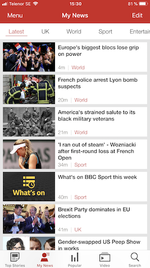
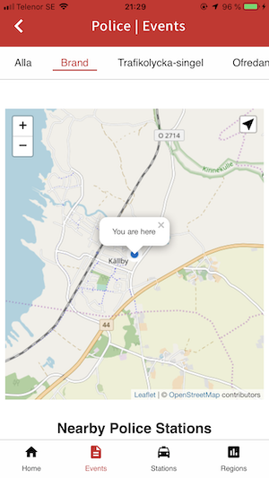
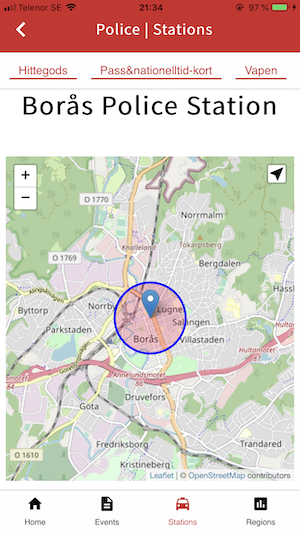

### Specifikation

Jag presenterar och knyter ihop data från tre olika API:er, listade nedan, för att skapa en användervänlig, funktionell och intressant app där fokus ligger på aktuella Polis aktiviteter.  Appen visar de senaste, 500, polis händelser inom Sverige ihop med en kortfattad beskrivning, tid, plats, karta med position och länk till polisens webbplats för varje unik händelse.  Genom att knyta ihop Polisens andra API med Polis stationer har jag kunnat kartlägga de närmaste Polis stationer, om de finns, till varje händelse.  Varje Polis station är också presenterade på en egen sidan ihop med address, länk till Stationens sida, karta med position samt stationens tillgängliga tjänster.  Den tredje API ger relevanta data som kommun kod och folkmäng, som presenteras ihop med varje Polis händelse och kompleterar de data som redan finns för att skapa en djupare översikt av platsen där en händelse har inträffat.  Data till denna API är presenterat i tabellform på en egen sida, Regions.  Det finns en karta med GPS för att visa användarens nuverande position, som markerar händelsens position och kartlägger närmaste Polis stationer på Events sidan och en karta som enbart markerar varje Polis Station på Stations sidan.  Man kan filtrera resultaten genom länkar på den horizontela scrollbaren under navbaren på Events och Stations sidorna.  För att komma till Stations och Regions sidorna måste man logga in eller registrera sig.

### Datakällor

1. Sveriges Kommuner och Landsting - https://catalog.skl.se/rowstore/dataset/8621fe21-0120-407e-a81f-705ef45f76d2/json
2. Polisen - https://polisen.se/api/policestations
3. Polisen - https://polisen.se/api/events

### Arkitektur

Denna app är uppbyggt på JavaScript med hjälp av Mithril och Cordova.  Jag har utvecklat appen med fokus på mobila enheter men ändå skapat en likvärdig upplevelse till större skärmar i webbläsaren.  Jag har lagt de mesta av logiken i www/js/models mappen ihop med en utility object för mer allmäna funktioner.  I view mappen så hanteras vyn, där layout vyn jobbar som central punkt för appen.  Istället för att ladda data från varje API individuellt på var sin sida så görs detta på layout sidan, vilket också hanterar navbaren, skrollbaren, allmän navigation samt header delen.  Denna vy finns på varje sida och kändes då relevant som bas till hela appen, framförallt när jag knyter ihop data från flera API:er.  Style är samlat i olika delar och knyts ihop med Sass, där jag använder variabler för att sätta bas färgerna och typsnitt.  När det gäller ikoner så har jag installerat lokalt Material Icons så att appen fungerar lika väl i offline läge.  Det finns en Content Security Policy, CSP, som ökar säkerheten mot ovälkomnen kod.  I www/models/config mappen lagrar jag min egen API-key som används för att logga in eller registrera olika användare med.  Jag lagrar den aktuella token i en fil för att skapa en sorts session, som är aktiv i enbart 24 timmar och då måste man logga in igen.  Jag gör en kontroll på index.js filen för att kolla om det finns en giltig inloggningstoken på Stations och Regions sidorna.  Här finns också koden för Pull To Refresh funktionalitetet.  Jag lagrar all data från de tre olika API:er i var sin JSON fil, 4st totalt med sessions filen, för att skapa ett användbart offline läge.  När appen laddas, med tanken på att det tar lite tid i början för att hämta data, framförallt Events API från polisen, så laddar jag först cachade data från current variablen eller om de inte finns, från JSON filen om den finns.  Detta skapar en snabbare starttid och levererar en bättre upplevelse.  Sedan i bakgrunden hämtas hem nytt data, JSON filerna är uppdaterade och sidan visar de nya värderna.  Appen har ett eget splash bild och ikon som finns i res mappen och fungerar på iOS, Android och browser läget.

### Krav 3: Native design

Jag har valt ut BBC News appen på iOS för att min app ska efterlikna den.  Detta var en rolig uppgift och krävde att man studera den befintliga appen noggrant när det gäller både design och funktionalitet.  Det första jag gjorde var att studera designen, där jag implementerade i min app liknande färger, typsnitt, layout, navigation samt generella smådetaljer.  När det gäller layouten, så tänkte jag att tabeller passar inte riktigt för mycket av innehållet om man jämför med BBC appen, så jag skapade en container för varje API resultat, på Events och Stations sidorna, och delade upp containern till två delar, bild på vänster sidan och text på höger, precis som i BBC appen.  I resultaten från min API så fanns det klockslag med varje Polis event så jag ville visa detta fast liknande som BBC appen gör.  Då skapade jag en funktion som räknar ut tiden som har gått jämfört med radens klockstämpel, nu visas hur många minuter eller timmar sedan som själva händelsen inträffade.  Jag presenterar också tiden med radens kategori länk bredvid till höger, precis som i BBC appen.  När man navigerar till detaljvyn för en Polis händelse eller station så finns samma knappdesign som BBC har för att gå tillbaka med samt nuvarande kategorin är markerad aktiv i scrollbaren.  Denna scrollbar fungerar samma som BBC appen gör, där man skrollar sydligt med touch eller klick genom alla kategorier för att filtrera innehållet som visas.  På Polisstations sidan så visas istället för kategorier alla tjänster som motsvarande station erbjuder.  Alla dessa stationstjänster är markerade aktiv i skrollbaren och man kan filtrera resultatet med de olika valen här med.  På BBC appen så finns det funktionalitet för att dra nedåt på skärmen för att uppdatera sidan, vilket jag har också återskapat.  Sidan laddas om och all data hämtas igen, vilket tar några sekunder innan det är klart och sidan refreshas med nytt data om tillgängligt.  Modulen som jag använder för denna funktionalitet är [PullToRefresh.js](https://www.boxfactura.com/pulltorefresh.js/).  Navbaren är designat för att efterlikna den i BBC Appen med likande ikoner och jag har även studerat appens padding och marginaler för att efterlikna så mycket som möjligt.  När det gäller innehåll, så har jag lagt till 5 olika bilder för Polis Events och Polis Stations, som loopas genom om och om för att ge ett snyggare, mer komplett, presentation av respektive API:s data och för att matcha BBC appen som jag efterliknar.  

Jag tycker att min App efterliknar BBC appen till en bra nivå men innehållet är inte exakt samma så identiska kommer de aldrig vara.

#### BBC News App

   

#### Min Police App

   
   
